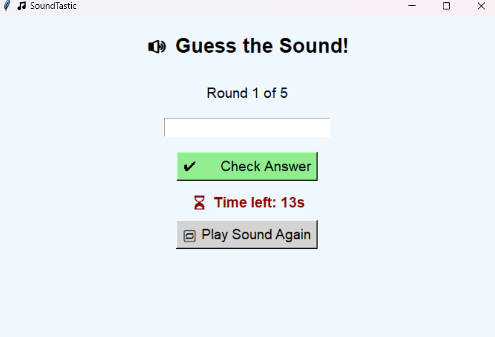

# 🎵 SoundTastic – Guess the Animal Sound Game

**SoundTastic** is a fun offline desktop game where you guess animal sounds by ear.  
Built with Python + `tkinter` + `pygame`. No install or Python needed – just play! 🐶🐔🐮

---

### 🔊 Gameplay



---

## 🚀 How to Play

1. Download the latest `.zip` from [Releases](https://github.com/EnacheVictor/SoundTastic/releases)
2. Unzip the folder
3. Double-click `SoundTastic.exe`
4. Listen and guess the animal sound
5. Type your answer and check if you're right!
6. Score is shown at the end. You can replay the game anytime.

---

## 🎮 Features

- 🔊 Real animal sounds (dog, cat, cow, etc.)
- ⏱️ 15 seconds per round
- ✔️ Score tracking (5 rounds per session)
- 🔁 Replay sound anytime
- 🔄 Restart button
- 🧠 Works without internet or Python

---

## 💻 Developer Info

### Requirements:
- Python 3.x
- pygame

### Run the game:
```bash
pip install pygame
python sound_guesser.py

Sounds are loaded automatically from the sounds/ folder
Use .wav files named like: dog.wav, cat.wav, cow.wav

📜 License
Licensed under the MIT License.
Free to use, modify, distribute – no liability.

🙌 Credits
Created with ❤️ by EnacheVictor
Feel free to fork, remix, or share!
